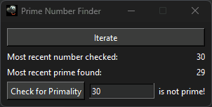

  

## Donations

 

## Purpose

The purpose of this project is to make a simple app to look for Prime Numbers and to check and see if any particular number you desire is prime.

## App Showcase

## Useful Information

- [Project Goals](https://github.com/users/melvinquick/projects/8/views/1)
